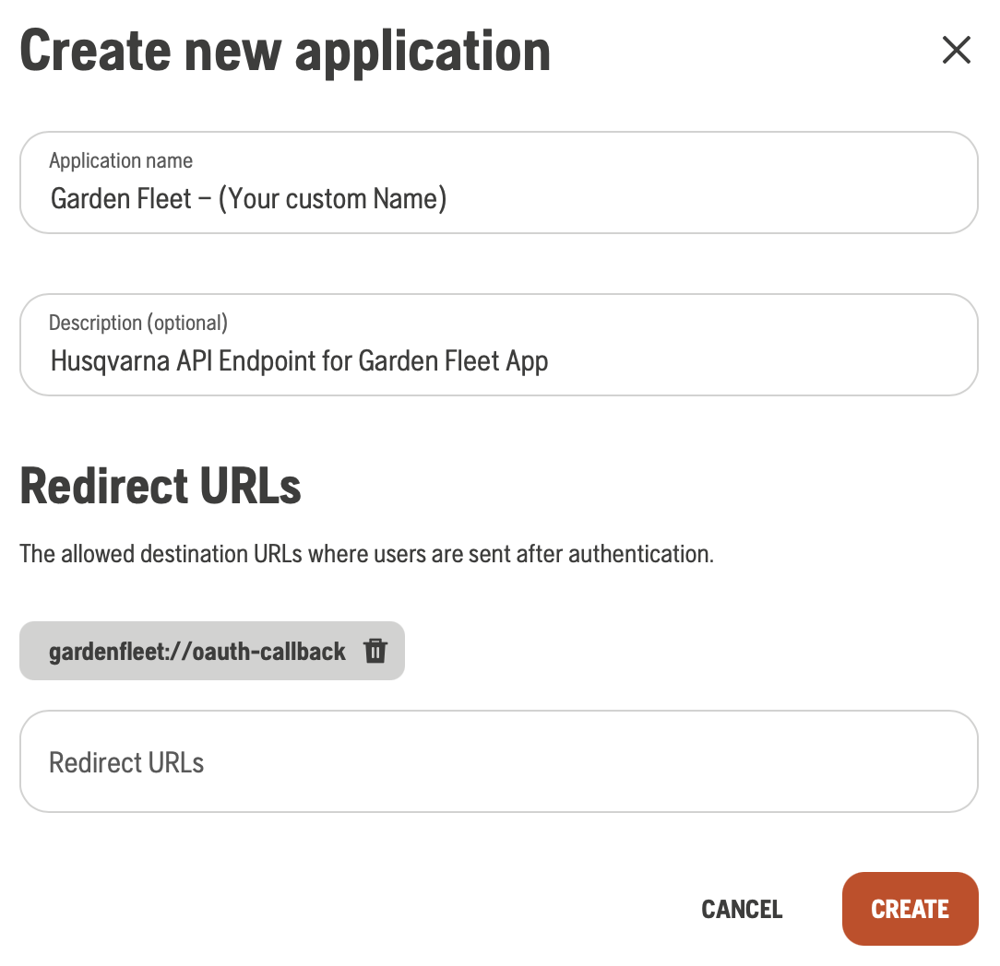
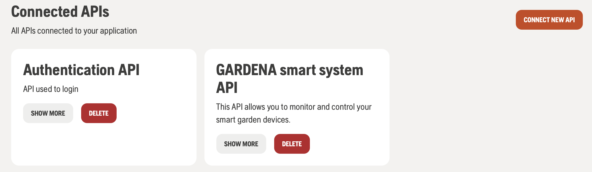
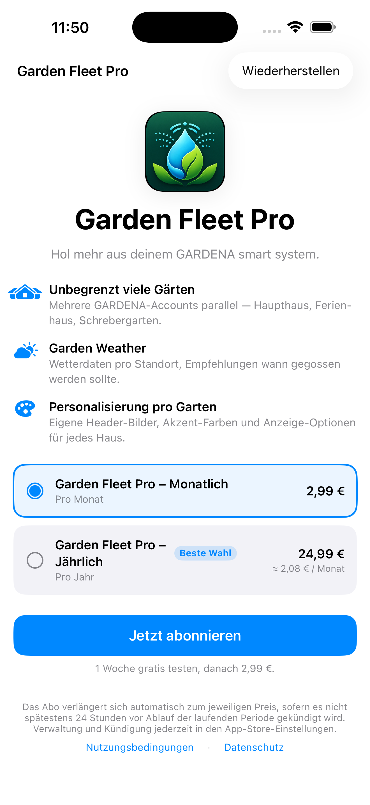
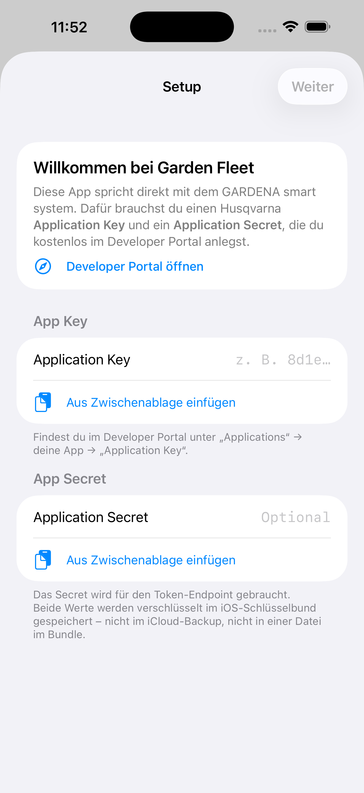
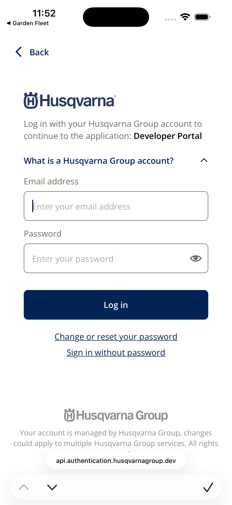
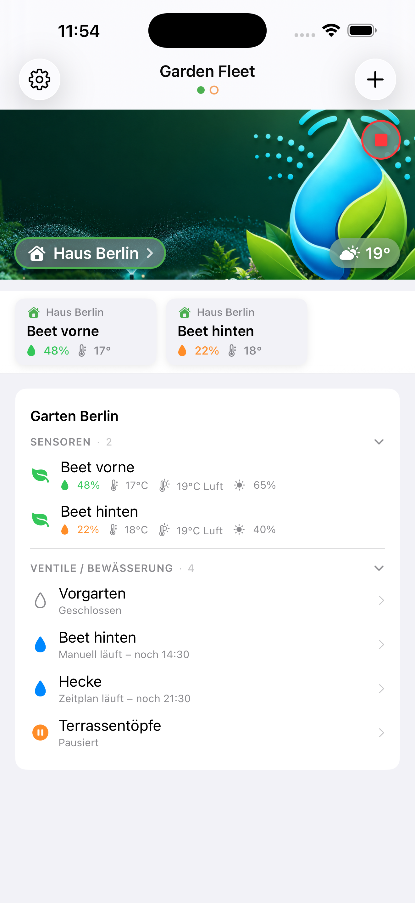

# Getting Started with Garden Fleet

_Last updated: 22 May 2026_

This guide walks you through every step needed to connect your GARDENA Smart System to Garden Fleet. From scratch it takes about 10 minutes — most of which is a one-off setup on Husqvarna's developer portal.

> 🇩🇪 Eine deutsche Fassung dieser Anleitung steht weiter unten unter [Erste Schritte mit Garden Fleet (Deutsch)](#erste-schritte-mit-garden-fleet-deutsch).
>
> 📖 Once Garden Fleet is set up, the [User Guide](USER-GUIDE.md) explains every feature in detail (dashboard, weather, valves, sensors, personalization, settings, Pro).

## What you'll need

- An iPhone or iPad that runs a current version of iOS.
- At least one **GARDENA Smart System gateway** already paired with a regular **GARDENA account**.
- A free **Husqvarna Developer account** (we'll create one in a moment).
- About 10 minutes — and afterwards you never have to do this again.

## The big picture

Garden Fleet is a **Bring-Your-Own-Key** app. You create a free **developer application** at Husqvarna once and receive two credentials: an **Application Key** and an **Application Secret**. You paste both into Garden Fleet during onboarding. From that point on, the app speaks **directly** to Husqvarna's official Smart System API on your behalf — no servers in between, no third parties reading along.

After that one-time setup, adding any number of GARDENA accounts (your home, a vacation rental, a client property, …) is a single tap that opens GARDENA's login page in a secure system browser.

```
GARDENA hardware
       │
       ▼
 Husqvarna cloud  ◄────────── OAuth + your Application Key
       ▲
       │
   Garden Fleet  ◄────────── you, on your iPhone
```

> ⚠️ **Note about screenshots and UI labels in this guide:** Husqvarna's Developer Portal evolves over time — button labels, sidebar positions or wording may change. The **principle** stays the same. If something looks different on your screen, always trust Husqvarna's [official "Get started" guide](https://developer.husqvarnagroup.cloud/docs/get-started) as the source of truth.

## Step 1 — Create a Husqvarna Developer account (≈ 5 min)

1. Open **<https://developer.husqvarnagroup.cloud/>** in any browser.
2. Click **Sign up** and register with a real email address. You don't need to be a developer — this account is free and exists exactly for what we are about to do.
3. Verify the email and sign in.

> Official Husqvarna onboarding documentation: **<https://developer.husqvarnagroup.cloud/docs/get-started>**

## Step 2 — Create an Application (≈ 3 min)

The Application is the bridge between Garden Fleet on your iPhone and your GARDENA hardware.



1. In the developer portal, open **My applications → Create application**.
2. Fill in the form:
   - **Name** — anything you want, you're the only one who sees it. We suggest `Garden Fleet — <your name>`.
   - **Description** — optional. Something like `Personal multi-garden dashboard`.
   - **Redirect URLs** — add **exactly** this URL, one entry only:
     ```
     gardenfleet://oauth-callback
     ```
3. Save the application.
4. On the application's detail page, scroll to the **Connected APIs** section.

   > 💡 **Best practice:** If the list looks short or you don't immediately see both entries below, click **"Show more"** (or its equivalent — Husqvarna's UI varies). Husqvarna sometimes hides less-used APIs behind that toggle.

   Connect **both** of the following APIs (the latest available version of each — Husqvarna keeps each at one current version, just pick what's offered):

   - **Authentication API** — handles your sign-in via OAuth.
   - **GARDENA Smart System API** — gives Garden Fleet read/write access to your gardens.

   You don't need to connect any other API (Automower, Husqvarna Fleet, etc.) — Garden Fleet only uses the two above.

   

5. Stay on this page. You'll see two values you need next — keep them handy:
   - **Application Key** (sometimes also called *Client ID*)
   - **Application Secret** (sometimes also called *Client Secret*)

> Husqvarna's official guide for creating an application is reachable through the same documentation site: **<https://developer.husqvarnagroup.cloud/docs/get-started>**

## Step 3 — Want to try Garden Fleet first? Use Demo Mode (≈ 30 sec)

Not sure yet whether Garden Fleet is right for you? You can explore the entire app **without** any Husqvarna setup or subscription:

1. Download Garden Fleet from the App Store: **<https://apps.apple.com/us/app/garden-fleet/id6771288984>**
2. On the first screen (the Pro paywall), tap **"View App Tour"** beneath the subscribe button.
3. The app opens in **Demo Mode** with two example gardens, sensors, valves and weather — all read-only.

Demo Mode is a real walkthrough of the UI; only the cloud calls are stubbed out. No Husqvarna credentials, no subscription, no signup. Tap **"Exit Demo"** when you're done.

## Step 4 — Start Garden Fleet Pro (≈ 1 min)

Garden Fleet is subscription-based with a 7-day free trial:



> 💶 **About the prices in this screenshot:** the amounts shown above are example values from the German App Store sandbox. **Actual prices vary by country and region** — Apple sets them based on your App Store. The price your device shows when you open Garden Fleet is the one that applies. Garden Fleet never sees or handles billing — Apple does that for us.

1. On the paywall, choose a plan (**Monthly**, **Yearly** or **Yearly with monthly billing**) and tap **"Start 7-Day Free Trial"**.
2. Apple asks you to confirm — Face ID / Touch ID or your Apple Account password.
3. The trial starts immediately. You will **not** be charged until day 7 — if you cancel before then, you pay nothing.
4. Manage or cancel anytime in **Settings → Apple Account → Subscriptions**.

What Pro unlocks: multi-account management, Garden Weather, per-home personalization, live updates — basically everything the app does beyond the demo.

## Step 5 — Connect your first garden (≈ 2 min)

After the trial starts, you land on the onboarding screen that asks for your Husqvarna credentials:



1. Paste the **Application Key** (from Step 2.5) into the first field.
2. Paste the **Application Secret** into the second field.
3. Tap **Continue**.
4. Garden Fleet now asks you to connect your first GARDENA account. Tap **Add account**.
5. A secure Apple-managed browser opens GARDENA's login page. Sign in with the email and password of the **GARDENA account that owns the hardware** (not the developer account).

   

6. After approval, the browser closes automatically and you land on your first dashboard.



> 🔐 **Where do your credentials live?** The Application Key, Secret and the OAuth tokens for each connected GARDENA account are stored **only** in the iOS Keychain on your device. There are no Garden Fleet servers between you and Husqvarna. If you uninstall the app, everything is gone with it. See the [User Guide](USER-GUIDE.md#1-privacy--security) for the full picture.

## Step 6 — Add more gardens

Got more than one garden? You can connect any number of additional GARDENA accounts to the same Garden Fleet installation:

1. Open **Settings → Add account**.
2. The same secure browser opens — sign in with the second account.
3. The new garden appears as its own page on the dashboard. Swipe horizontally between them, just like in Apple Weather between cities.

You only ever need **one** Application Key and Secret — regardless of how many GARDENA accounts you connect afterwards.

> 📖 Once you have at least one garden connected, head over to the [User Guide](USER-GUIDE.md) for everything the app can do: personalization, weather, valve control, sensors, settings.

## Best practices

- **One developer account is enough.** It's per person, not per garden. Don't create a second developer account; use one for all your GARDENA accounts.
- **One Application Key serves all your gardens.** The Application Key authorises Garden Fleet on your phone. The **GARDENA account** chosen during sign-in decides which physical hardware Garden Fleet sees.
- **Your main GARDENA account counts as one garden.** The GARDENA account you happen to use most often is just one account among many — connect it the same way as any vacation home or client site. It is not "linked" to your developer account in any special way; the developer account is for your *application*, the GARDENA account is for your *hardware*.
- **Each additional GARDENA account is independent.** Vacation home, rental, client property — each can have its own GARDENA login and shows up as a separate dashboard page. They never share data; Garden Fleet keeps them strictly separated in the Keychain.
- **Don't share your Application Key.** Husqvarna allows only three active session tokens per developer account, so sharing causes lock-outs. If a partner or family member wants to use Garden Fleet, they should create their own developer account.
- **Respect Husqvarna's login limits.** Ten failed login attempts in five minutes trigger a 30-minute account lock. If you mistype your GARDENA password a couple of times, wait it out — don't keep retrying.
- **Use the same Key on iPad and iPhone.** Garden Fleet doesn't sync between devices; each device needs its own one-time onboarding with the same Application Key and Secret. (This is also the reason your other devices keep working even when you uninstall the app on one of them.)

## Troubleshooting

### "Invalid credentials" right after entering the Application Key
- Double-check that you pasted the **Application Key** into the first field and the **Application Secret** into the second. The portal displays both in the same monospace style and they're easy to mix up.
- Make sure no leading or trailing space sneaked in during copy-paste.
- Make sure the Application has **both** the **Authentication API** and the **GARDENA Smart System API** connected (Step 2.4) — missing either one causes this error.

### The login page opens but rejects my password
- Use the password of your **consumer GARDENA account** (the one that owns the hardware), not the developer account from Step 1. Husqvarna keeps these as two separate accounts even if both use the same email.
- If you use a password manager, double-check it didn't auto-fill the developer credentials by mistake.

### Sensor values or valve state look stale
- Pull-to-refresh on the dashboard once.
- If Garden Fleet has been sitting in the background for hours, give it a few seconds after foregrounding to re-establish the live connection.
- If a sensor's timestamp is older than an hour, that's normal — GARDENA's sensors typically broadcast every 30–60 minutes to save battery. Garden Fleet shows the latest value reported by the sensor.

### "Account locked" or "too many requests" error
- Husqvarna enforces hard limits (10 failed logins per 5 minutes → 30 minute lock; about 10 API calls per 10 seconds; ~700 calls per week per Application). Wait 30 minutes and try again. Garden Fleet is built to stay comfortably below these limits in normal use; locks usually only show up during repeated test-resets of the onboarding.

### My Application doesn't show up under "My applications"
- Make sure you're signed into the same developer email you registered in Step 1. If you have several Husqvarna accounts (e.g. consumer + business), check each.

### I can't see the Authentication API under Connected APIs
- Click **"Show more"** (or the equivalent toggle) — Husqvarna sometimes hides it behind that. If it still doesn't appear, log out, log in again and reload the application detail page.

## Help and support

- Email: **<gardenfleet@icloud.com>**
- GitHub issues: **<https://github.com/GardenFleet/GardenFleet/issues>**
- Husqvarna Developer Portal: **<https://developer.husqvarnagroup.cloud/>**
- Detailed feature documentation: **[User Guide](USER-GUIDE.md)**

---

# Erste Schritte mit Garden Fleet (Deutsch)

_Letzte Aktualisierung: 22. Mai 2026_

Diese Anleitung führt dich Schritt für Schritt durch alles, was du brauchst, um dein GARDENA Smart System mit Garden Fleet zu verbinden. Von null an dauert das etwa 10 Minuten — die meiste Zeit davon ist eine einmalige Einrichtung auf Husqvarnas Entwickler-Portal.

> 📖 Sobald Garden Fleet eingerichtet ist, erklärt das [Benutzerhandbuch](USER-GUIDE.md) jede Funktion im Detail (Dashboard, Wetter, Ventile, Sensoren, Personalisierung, Einstellungen, Pro).

## Was du brauchst

- Ein iPhone oder iPad mit einer aktuellen iOS-Version.
- Mindestens ein **GARDENA Smart System Gateway**, das bereits mit einem regulären **GARDENA-Konto** gekoppelt ist.
- Einen kostenlosen **Husqvarna Developer Account** (legen wir gleich an).
- Etwa 10 Minuten — und danach musst du das nie wieder machen.

## Das große Bild

Garden Fleet ist eine **Bring-Your-Own-Key-App**. Du legst einmalig eine kostenlose **Entwickler-Anwendung** bei Husqvarna an und erhältst zwei Zugangsdaten: einen **Application Key** und ein **Application Secret**. Beide gibst du beim ersten Start in Garden Fleet ein. Ab dann spricht die App **direkt** mit Husqvarnas offizieller Smart-System-API in deinem Auftrag — ohne Server dazwischen, ohne Dritte, die mitlesen könnten.

Nach dieser einmaligen Einrichtung ist das Hinzufügen weiterer GARDENA-Konten (Ferienhaus, Kundenobjekt, Schrebergarten, …) ein einzelner Tap, der die GARDENA-Anmeldeseite in einem sicheren System-Browser öffnet.

```
GARDENA-Hardware
       │
       ▼
 Husqvarna-Cloud  ◄────────── OAuth + dein Application Key
       ▲
       │
   Garden Fleet  ◄────────── du, auf deinem iPhone
```

> ⚠️ **Hinweis zu Screenshots und UI-Bezeichnungen in dieser Anleitung:** Husqvarnas Developer Portal entwickelt sich weiter — Button-Beschriftungen, Sidebar-Positionen oder Formulierungen können sich ändern. Das **Prinzip** bleibt gleich. Wenn etwas bei dir anders aussieht, ist Husqvarnas [offizielle „Get started"-Anleitung](https://developer.husqvarnagroup.cloud/docs/get-started) immer die verbindliche Quelle.

## Schritt 1 — Husqvarna Developer Account anlegen (≈ 5 Min)

1. Öffne **<https://developer.husqvarnagroup.cloud/>** in einem beliebigen Browser.
2. Klicke auf **Sign up** und registriere dich mit einer echten E-Mail-Adresse. Du musst kein Entwickler sein — dieser Account ist kostenlos und existiert genau für das, was wir gleich machen.
3. Bestätige die E-Mail und melde dich an.

> Offizielle Husqvarna-Doku zum Entwickler-Portal: **<https://developer.husqvarnagroup.cloud/docs/get-started>**

## Schritt 2 — Application anlegen (≈ 3 Min)

Die Application ist die Brücke zwischen Garden Fleet auf deinem iPhone und deiner GARDENA-Hardware.


1. Im Developer Portal: **My applications → Create application**.
2. Fülle das Formular aus:
   - **Name** — frei wählbar, sehen nur du. Vorschlag: `Garden Fleet — <dein Name>`.
   - **Description** — optional, z. B. `Persönliches Multi-Garten-Dashboard`.
   - **Redirect URLs** — gib **genau** diese URL ein, nur diese eine:
     ```
     gardenfleet://oauth-callback
     ```
3. Speichern.
4. Auf der Detailseite der Application: scrolle zum Abschnitt **Connected APIs**.

   > 💡 **Best Practice:** Wenn die Liste sehr kurz wirkt oder du nicht beide unten genannten Einträge siehst, klicke auf **„Show more"** (oder die entsprechende Beschriftung — Husqvarnas UI variiert). Husqvarna blendet selten genutzte APIs manchmal hinter diesem Schalter aus.

   Verbinde **beide** folgenden APIs (jeweils in der aktuell verfügbaren Version — Husqvarna pflegt von jeder API nur eine Live-Version, nimm einfach die angebotene):

   - **Authentication API** — kümmert sich um deine Anmeldung via OAuth.
   - **GARDENA Smart System API** — gibt Garden Fleet Lese-/Schreibzugriff auf deine Gärten.

   Andere APIs (Automower, Husqvarna Fleet, …) musst du nicht verbinden — Garden Fleet nutzt nur die beiden oben genannten.

   

5. Bleibe auf dieser Seite. Du siehst zwei Werte, die du gleich brauchst — halte sie bereit:
   - **Application Key** (manchmal auch *Client ID* genannt)
   - **Application Secret** (manchmal auch *Client Secret* genannt)

> Husqvarnas offizielle Anleitung zum Anlegen einer Application liegt im selben Doku-Portal: **<https://developer.husqvarnagroup.cloud/docs/get-started>**

## Schritt 3 — Garden Fleet erst ausprobieren? Demo-Modus (≈ 30 Sek)

Du bist noch unsicher, ob Garden Fleet das Richtige für dich ist? Du kannst die komplette App **ohne** Husqvarna-Setup und **ohne** Abo testen:

1. Lade Garden Fleet aus dem App Store: **<https://apps.apple.com/de/app/garden-fleet/id6771288984>**
2. Auf dem ersten Bildschirm (der Pro-Paywall): tippe **„App-Tour ansehen"** unter dem Abo-Button.
3. Die App öffnet sich im **Demo-Modus** mit zwei Beispiel-Gärten, Sensoren, Ventilen und Wetter — alles Read-Only.

Der Demo-Modus ist ein echter Rundgang durch das UI; nur die Cloud-Calls sind ausgeblendet. Keine Husqvarna-Zugangsdaten, kein Abo, keine Anmeldung nötig. Tippe **„Demo beenden"**, wenn du fertig bist.

## Schritt 4 — Garden Fleet Pro starten (≈ 1 Min)

Garden Fleet ist abo-basiert mit 7-tägiger kostenloser Probezeit:


> 💶 **Zu den Preisen im Screenshot:** die angezeigten Beträge sind Beispielwerte aus der deutschen App-Store-Sandbox. **Die tatsächlichen Preise unterscheiden sich nach Land und Region** — Apple legt sie basierend auf deinem App Store fest. Der Preis, den dein Gerät beim Öffnen von Garden Fleet anzeigt, ist der für dich gültige. Garden Fleet sieht oder verarbeitet keine Abrechnungsdaten — das übernimmt Apple.

1. Auf der Paywall: wähle einen Plan (**Monatlich**, **Jährlich** oder **Jährlich mit Monatszahlung**) und tippe auf **„7-Tage-Probezeit starten"**.
2. Apple bittet dich um Bestätigung — Face ID / Touch ID oder dein Apple-Konto-Passwort.
3. Die Probezeit startet sofort. Es wird **nichts** abgebucht, bevor Tag 7 abgelaufen ist — wenn du vorher kündigst, zahlst du nichts.
4. Verwalten oder kündigen kannst du jederzeit unter **Einstellungen → Apple-Konto → Abonnements**.

Was Pro freischaltet: Multi-Account-Verwaltung, Garden Weather, Personalisierung pro Haus, Live-Updates — also alles, was die App jenseits der Demo kann.

## Schritt 5 — Den ersten Garten verbinden (≈ 2 Min)

Sobald die Probezeit gestartet ist, landest du auf dem Onboarding-Bildschirm, der nach deinen Husqvarna-Zugangsdaten fragt:


1. Trage den **Application Key** (aus Schritt 2.5) ins erste Feld ein.
2. Trage das **Application Secret** ins zweite Feld ein.
3. Tippe auf **Weiter**.
4. Garden Fleet bittet dich nun, dein erstes GARDENA-Konto zu verbinden. Tippe auf **Account hinzufügen**.
5. Ein von Apple bereitgestellter sicherer Browser öffnet die GARDENA-Anmeldeseite. Melde dich mit der E-Mail und dem Passwort des **GARDENA-Kontos an, dem die Hardware gehört** (nicht mit dem Developer-Account).

   

6. Nach der Bestätigung schließt sich der Browser automatisch, und du landest auf deinem ersten Dashboard.


> 🔐 **Wo liegen deine Zugangsdaten?** Der Application Key, das Secret und die OAuth-Tokens jedes verbundenen GARDENA-Kontos werden **ausschließlich** im iOS-Keychain auf deinem Gerät gespeichert. Es gibt keine Garden-Fleet-Server zwischen dir und Husqvarna. Wenn du die App deinstallierst, sind die Daten weg. Siehe [Benutzerhandbuch](USER-GUIDE.md#1-datenschutz--sicherheit) für das vollständige Bild.

## Schritt 6 — Weitere Gärten hinzufügen

Hast du mehr als einen Garten? Du kannst beliebig viele GARDENA-Konten mit derselben Garden-Fleet-Installation verbinden:

1. Öffne **Einstellungen → Account hinzufügen**.
2. Derselbe sichere Browser öffnet sich — melde dich mit dem zweiten Konto an.
3. Der neue Garten erscheint als eigene Seite im Dashboard. Wische horizontal zwischen den Gärten, genau wie in Apple Wetter zwischen Städten.

Du brauchst nur **einen** Application Key und ein Secret — egal, wie viele GARDENA-Konten du anschließend verbindest.

> 📖 Sobald mindestens ein Garten verbunden ist, geht's im [Benutzerhandbuch](USER-GUIDE.md) weiter mit allem, was die App kann: Personalisierung, Wetter, Ventil-Steuerung, Sensoren, Einstellungen.

## Best Practices

- **Ein Developer-Account reicht.** Er ist pro Person, nicht pro Garten. Lege keinen zweiten Developer-Account an; nutze einen für alle deine GARDENA-Konten.
- **Ein Application Key bedient alle deine Gärten.** Der Application Key autorisiert Garden Fleet auf deinem Telefon. Das beim Anmelden gewählte **GARDENA-Konto** entscheidet, welche Hardware Garden Fleet sieht.
- **Dein Haupt-GARDENA-Konto zählt als ein Garten unter vielen.** Das GARDENA-Konto, das du im Alltag am häufigsten nutzt, ist einfach eines unter vielen — du verbindest es genauso wie jedes Ferienhaus oder Kundenobjekt. Es ist **nicht** mit deinem Developer-Account auf irgendeine Weise „verbunden": der Developer-Account ist für deine *Application*, das GARDENA-Konto ist für deine *Hardware*.
- **Jedes weitere GARDENA-Konto ist eigenständig.** Ferienhaus, Mietobjekt, Kundenanlage — jedes kann seinen eigenen GARDENA-Login haben und erscheint als eigene Dashboard-Seite. Sie teilen keine Daten; Garden Fleet hält sie strikt voneinander getrennt im Keychain.
- **Teile deinen Application Key nicht.** Husqvarna erlaubt nur drei aktive Session-Tokens pro Developer-Account; Teilen führt zu Sperren. Wenn ein Partner oder Familienmitglied Garden Fleet nutzen möchte, sollte er/sie einen eigenen Developer-Account anlegen.
- **Respektiere Husqvarnas Login-Limits.** Zehn fehlgeschlagene Login-Versuche in fünf Minuten lösen eine 30-minütige Konto-Sperre aus. Wenn du dein GARDENA-Passwort zwei- oder dreimal vertippst, warte einfach kurz ab — nicht weiter probieren.
- **Auf iPad und iPhone gleich einrichten.** Garden Fleet synchronisiert nichts zwischen Geräten; jedes Gerät braucht eine eigene Einmal-Einrichtung mit demselben Application Key und Secret. (Das ist auch der Grund, warum deine anderen Geräte weiter funktionieren, wenn du die App auf einem davon löschst.)

## Fehlerbehebung

### „Ungültige Zugangsdaten" direkt nach Eingabe des Application Keys
- Prüfe, dass du den **Application Key** ins erste Feld und das **Application Secret** ins zweite Feld eingegeben hast. Das Portal stellt beide im gleichen Monospace-Stil dar, sie sind leicht zu verwechseln.
- Achte darauf, dass beim Kopieren kein Leerzeichen am Anfang oder Ende eingeschmuggelt wurde.
- Prüfe, dass deine Application **sowohl** die **Authentication API** als auch die **GARDENA Smart System API** verbunden hat (Schritt 2.4) — wenn eine der beiden fehlt, kommt dieser Fehler.

### Die Login-Seite öffnet sich, aber das Passwort wird abgelehnt
- Nutze das Passwort deines **GARDENA-Verbraucherkontos** (das, dem die Hardware gehört), nicht das Developer-Konto aus Schritt 1. Husqvarna verwaltet beide als getrennte Konten — selbst wenn beide dieselbe E-Mail-Adresse haben.
- Wenn du einen Passwort-Manager nutzt, prüfe, dass er nicht versehentlich die Developer-Daten eingefüllt hat.

### Sensorwerte oder Ventil-Status wirken veraltet
- Wische einmal auf dem Dashboard nach unten, um zu aktualisieren.
- Wenn Garden Fleet längere Zeit im Hintergrund war, gib ihr nach dem Öffnen ein paar Sekunden, um die Live-Verbindung wieder aufzubauen.
- Wenn der Zeitstempel eines Sensors älter als eine Stunde ist, ist das normal — GARDENAs Sensoren funken üblicherweise nur alle 30–60 Minuten, um die Batterie zu schonen. Garden Fleet zeigt den letzten vom Sensor gesendeten Wert.

### „Konto gesperrt" oder „Zu viele Anfragen"
- Husqvarna setzt harte Limits (10 fehlgeschlagene Logins pro 5 Min → 30-Min-Sperre; etwa 10 API-Calls pro 10 Sekunden; ~700 Calls pro Woche pro Application). Warte 30 Minuten und versuche es erneut. Garden Fleet ist so gebaut, dass sie im Normalbetrieb deutlich unter diesen Limits bleibt; Sperren tauchen meist nur bei wiederholten Test-Resets des Onboardings auf.

### Meine Application taucht nicht unter „My applications" auf
- Stelle sicher, dass du mit derselben E-Mail eingeloggt bist, die du in Schritt 1 registriert hast. Falls du mehrere Husqvarna-Konten hast (z. B. Verbraucher + Business), prüfe jedes.

### Ich finde die Authentication API nicht unter Connected APIs
- Klicke auf **„Show more"** (oder den entsprechenden Schalter) — Husqvarna versteckt sie manchmal dahinter. Wenn sie trotzdem nicht auftaucht: einmal abmelden, neu anmelden, Application-Detailseite neu laden.

## Hilfe und Support

- E-Mail: **<gardenfleet@icloud.com>**
- GitHub Issues: **<https://github.com/GardenFleet/GardenFleet/issues>**
- Husqvarna Developer Portal: **<https://developer.husqvarnagroup.cloud/>**
- Ausführliche Funktionsdokumentation: **[Benutzerhandbuch](USER-GUIDE.md)**
