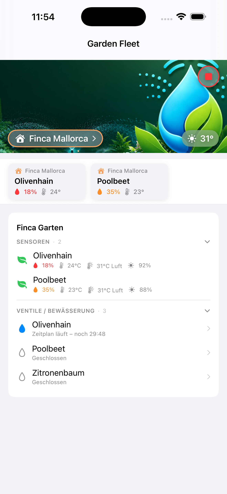
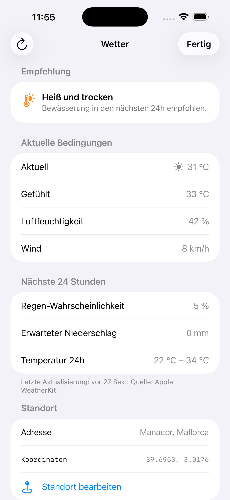
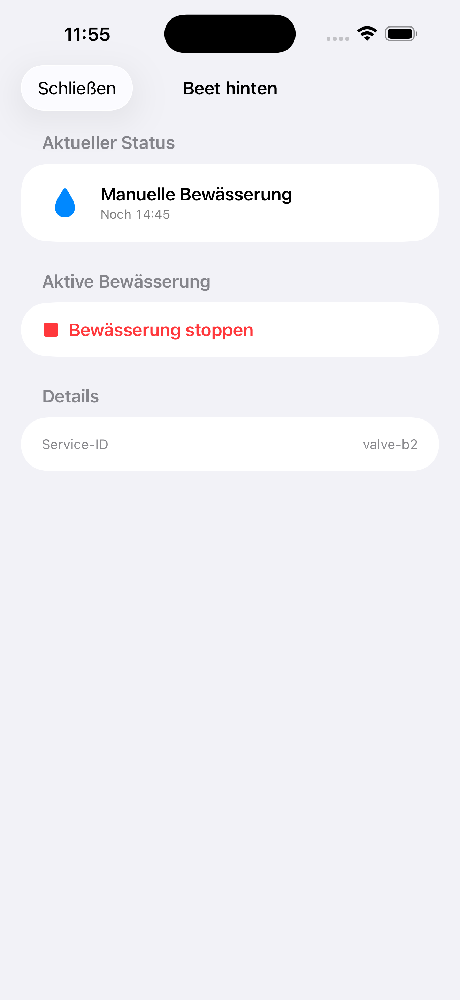
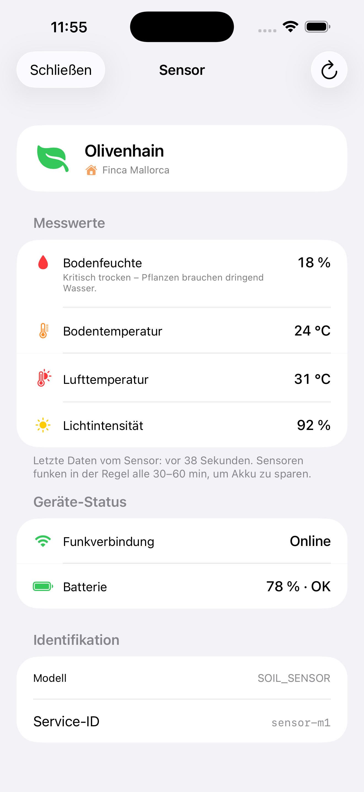

# Garden Fleet — User Guide

_Last updated: 22 May 2026 — covers app version 1.0.1_

This guide explains what Garden Fleet can do and how to use it day to day. If you're setting up the app for the first time, start with the [Getting Started guide](GETTING-STARTED.md) — it walks you through the one-time Husqvarna and onboarding steps.

> 🇩🇪 Eine deutsche Fassung steht weiter unten unter [Benutzerhandbuch (Deutsch)](#benutzerhandbuch-deutsch).

## Quick tour

Garden Fleet is a multi-garden dashboard for the GARDENA Smart System. The core idea: every garden you connect gets its own page. You swipe horizontally between pages — exactly like Apple Weather between cities — and each page shows that garden's sensors, valves, weather and live status in real time.


You're not limited to one GARDENA account. Vacation home, rental, client property — connect as many as you want, all from the same app on the same device. Garden Fleet keeps them strictly separate.

## 1. Privacy & security

This section comes first on purpose — because if you're going to paste your Husqvarna credentials into an app, you deserve to know exactly what happens with them.

### What Garden Fleet does NOT do
- **No Garden Fleet servers.** There is no Garden Fleet backend. Your phone talks directly to Husqvarna's official cloud and to Apple's WeatherKit service. No third-party servers see your data, period.
- **No user tracking.** No analytics SDKs, no behavioural tracking, no ads. The app does not phone home.
- **No cloud sync.** Garden Fleet does not back up your accounts, settings, or gardens to any cloud — not iCloud, not anything else. Your data lives on the device you installed the app on.

### Where your data lives
- **Application Key + Secret** (from Husqvarna): encrypted in the iOS Keychain.
- **OAuth tokens** for each connected GARDENA account: encrypted in the iOS Keychain.
- **Sensor/valve/garden snapshots**: cached as JSON files in the app's private Documents folder (per account) — only readable by Garden Fleet itself.
- **Header images** you've uploaded for a garden: in the app's private Documents folder.
- **Weather data**: cached for 60 minutes in the app's private Documents folder.
- **Settings** (display preferences, current page, accent colors): in the app's private UserDefaults.

If you uninstall Garden Fleet, all of the above is removed automatically.

### Who talks to whom
```
            ┌────────────────────────────┐
            │  Husqvarna Smart System    │
            │  & Authentication API      │
            └─────────────▲──────────────┘
                          │ HTTPS + your OAuth tokens
                          │
            ┌─────────────┴──────────────┐
            │       Garden Fleet         │
            │     (on your iPhone)       │
            └─────────────┬──────────────┘
                          │ HTTPS
                          ▼
            ┌────────────────────────────┐
            │     Apple WeatherKit       │
            │   (weather per location)   │
            └────────────────────────────┘
```

That's it. Two destinations, both official, both encrypted in transit.

## 2. The Dashboard

The dashboard is Garden Fleet's home screen. When you have at least one connected garden, opening the app drops you straight into it.

### One garden vs. multiple gardens
- **One garden:** the dashboard shows that garden directly. No page indicator.
- **Two or more gardens:** the dashboard becomes a horizontal pager. Swipe left/right to switch, page indicator dots at the top tell you where you are. Your last-viewed page is remembered between launches.



### Anatomy of a garden page
- **Header image** at the top — your own photo, the global default, or the accent color as a gradient (see [Personalization](#4-personalize-a-garden)).
- **Weather badge** — top-right of the header (or top-left at very large accessibility text sizes). Tap for the weather detail view.
- **House-Pill** — bottom-left of the header, showing the garden's symbol, name and accent-color outline. Tap to open Edit Account.
- **Stop-All button** — top-right of the header, visible only when at least one valve is currently watering. Red with a confirmation dialog. Use it to instantly stop **all** active valves in **this** garden.
- **Sensor strip** — horizontal scroll of soil moisture, temperature, humidity and light values for sensors in this garden.
- **Valves list** — every valve in the garden as a card with current state, runtime countdown if running, and quick controls.

### Reorder your gardens (drag & drop)
New in 1.0.1: long-press the page indicator at the top and drag pages around to reorder your gardens. Your preferred order is remembered.

## 3. Connecting gardens

### Your first garden
Already covered in [Getting Started → Step 5](GETTING-STARTED.md#step-5--connect-your-first-garden--2-min). Briefly: paste Application Key + Secret, tap "Add account", sign in with your GARDENA credentials in the secure browser.

### Additional, independent gardens
This is the killer feature: Garden Fleet supports any number of additional GARDENA accounts, **completely independent** from your first one.

1. Open **Settings → Add account**.
2. Choose an accent color and symbol for the new garden (you can change both later).
3. Tap **"Sign in with GARDENA"**. The secure browser opens.
4. **Important:** sign in with the GARDENA account that owns the *new* garden's hardware. This can be:
   - Your own GARDENA account for a second property of yours.
   - Your spouse's, family member's, or housemate's GARDENA account.
   - A separate account for a vacation rental or client property.
5. After approval, the new garden appears as its own page on the dashboard.

There is no shared data between accounts — each garden's tokens, sensors, valves and history are stored independently in the Keychain. Removing one account does not affect any other.

### Re-authentication
If a garden's OAuth refresh token expires (Husqvarna keeps them valid for 24h, but Garden Fleet refreshes them in the background every ~6h), or if you change your GARDENA password, the affected garden will show a yellow "Re-authentication needed" banner. Tap **"Re-authenticate"** in Edit Account and sign in again — your other gardens are unaffected.

### Removing a garden
Open the garden you want to remove → House-Pill → **Edit Account** → scroll to the **Danger Zone** section → **Remove Account**. Garden Fleet revokes the OAuth tokens at Husqvarna immediately, then clears the local Keychain entries and cached data for this garden.

## 4. Personalize a garden

Every garden has its own visual identity. Open the **Edit Account** view from the House-Pill (bottom-left of the header) to customize:

### Header image
Three options for what appears at the top of the page:
- **Your own image** — tap "Choose image" and pick from your photo library. Garden Fleet stores it locally in its own Documents folder, so it doesn't sync to iCloud.
- **Global default** — Garden Fleet's stock header image (a generic garden scene).
- **Accent color as gradient** (new in 1.0.1) — a clean gradient based on the garden's accent color. Perfect if you don't have a good photo handy.

Changes are committed only when you tap **Save**. **Cancel** discards.

### Accent color
Pick from the palette of preset colors, or use the custom color well to choose anything. The accent color shows up:
- As the stroke around the House-Pill
- Around the sensor chips (header indicator)
- As gradient fallback if no header image is set
- In valve detail headers

### Symbol
Pick from six built-in symbols (house, leaf, tree, mountain, building, beach umbrella) to differentiate this garden visually — important if you're red-green colorblind (Differentiate Without Color) or just want to scan faster. The symbol appears on the House-Pill, sensor chips, and the sensor/valve detail headers.

### Display name
Free text — what you'd call this garden in conversation ("Berlin home", "Cornwall cottage", "Müller property").

### Location
The street address for weather data. See the [Weather](#5-weather) section below for details.

## 5. Weather

Garden Fleet integrates Apple WeatherKit to show weather data per garden — same source Apple Weather uses, so you get the most accurate local forecast.

### Setting up
In Edit Account → **Location**, enter the garden's address. Garden Fleet geocodes it to coordinates (using Apple's reverse geocoder, not a third-party service) and stores them with the garden.

### What you see
- **Weather badge** in the header: current temperature + a weather symbol.
- Tap the badge to open the **Weather Detail View**:
  - Current conditions
  - Today's forecast (high/low, precipitation chance)
  - Multi-day outlook
  - **Irrigation recommendation** — Garden Fleet looks at upcoming precipitation and gives you a hint like "Likely no need to water today — 6mm rain expected".



### Editing the location
- In the Weather Detail View, tap **"Edit address"** — Garden Fleet now jumps **straight to the Location section** in Edit Account (new in 1.0.1; before it landed at the top of the form).
- Update the address, tap **Save**. The weather updates within seconds.

### Cache
Weather is cached for 60 minutes per garden. Pull-to-refresh forces a fresh fetch. If you have many gardens, this keeps WeatherKit usage low (and free).

## 6. Operating valves

### Manual start
On the dashboard, tap a valve card and use the slider or quick-buttons (15, 30, 60 min) to start watering. A live **countdown** appears on the card, showing the remaining time.



### Manual stop
Tap the running valve and choose **Stop**.

### Stop-All
When **any** valve in a garden is currently watering, the **Stop-All** button appears in the top-right of the dashboard header. Tap it (and confirm the dialog) to stop every active valve in that garden at once. This is your safety net for "I left a valve running by accident" moments.

### What Garden Fleet sends to Husqvarna
A start command includes the valve ID and the duration in seconds. A stop command includes only the valve ID. Garden Fleet does **not** send any other data with these commands. The HTTP request goes directly from your iPhone to Husqvarna's API, signed with your OAuth token.

### Rate limits
Husqvarna allows about 10 API calls per 10 seconds per Application. In practice you'll never hit this from manual valve operations — Garden Fleet's WebSocket-first architecture keeps polling to near-zero in normal use.

## 7. Sensors

GARDENA sensors broadcast their readings every 30–60 minutes (to save battery). Garden Fleet displays:

- **Soil moisture** (%)
- **Soil temperature** (°C / °F depending on system setting)
- **Ambient temperature** (°C / °F)
- **Air humidity** (%)
- **Light intensity** (lux)

Not every sensor reports every value — what's available depends on the specific GARDENA sensor model.

### Sensor strip on the dashboard
Each sensor is one chip on the strip. Tap to open the **Sensor Detail View** with all available readings, the timestamp of the last update, and the sensor's location.



### "Last update X hours ago"
Don't worry if a sensor's last update was an hour ago — that's normal. GARDENA's sensors are battery-driven and prioritize battery life over data freshness. Garden Fleet shows the most recent value the sensor has reported.

### Live updates via WebSocket
Garden Fleet maintains a WebSocket connection to Husqvarna's Smart System API while the app is foregrounded. New sensor readings push to the app within seconds — no polling, no delay.

## 8. Settings

Open Settings via the gear icon in the dashboard toolbar (top-left).

### Accounts
- **Add account** — connect another GARDENA account (see [Section 3](#3-connecting-gardens)).
- Each connected account appears in a list — tap to jump to its Edit Account view.

### Subscription
- **Status** — shows your current Pro plan (Monthly, Yearly, Trial) and renewal date.
- **Manage** — opens Apple's subscription management sheet.
- **Restore Purchases** — useful after reinstalling the app or switching to a new device.

See [Section 9](#9-garden-fleet-pro) for details.

### API configuration
- **View / change Application Key + Secret** — useful if you need to switch to a different Husqvarna developer application, or if your old one was revoked.
- **Reset setup** — deletes the Application Key + Secret from the Keychain and returns the app to onboarding. This does **not** delete your connected GARDENA accounts; their tokens remain in the Keychain and they reappear once you re-enter a valid Application Key.

### Accessibility
Garden Fleet supports nine of Apple's Accessibility Nutrition Labels (VoiceOver, Voice Control, Larger Text, Dark Interface, Differentiate Without Color, Sufficient Contrast, Reduced Motion — captions and audio descriptions don't apply since the app has no audio/video content). All standard iOS Accessibility settings apply automatically.

### Legal
- Privacy Policy, Terms of Use, Imprint, Accessibility statement — open in the system browser.

## 9. Garden Fleet Pro

Garden Fleet is subscription-based. After the 7-day free trial you pick one of three plans:


> 💶 **About the prices in this screenshot:** the amounts shown are example values from the German App Store sandbox. **Actual prices vary by country and region** — Apple sets them based on your App Store, and the price your device shows is the one that applies. Garden Fleet never sees or handles billing — Apple does.

- **Monthly** — paid every month.
- **Yearly** — paid once a year (best per-month price).
- **Yearly with monthly billing** — same total as Yearly, billed monthly.

All three tiers unlock the same feature set. Pricing is shown in the App Store and may vary by region — Apple handles the billing.

### What's free vs. Pro?
Currently, **everything beyond the demo requires Pro**. There is no free tier with limited functionality. The reasoning is simple: maintaining Garden Fleet, paying for an Apple Developer account, and dealing with API limits costs real money — and we don't show ads.

If Pro isn't right for you, the **Demo Mode** ([Getting Started → Step 3](GETTING-STARTED.md#step-3--want-to-try-garden-fleet-first-use-demo-mode--30-sec)) lets you explore the entire UI without any obligation.

### Cancelling
Open the iOS **Settings app → Apple Account → Subscriptions → Garden Fleet Pro** and choose **Cancel Subscription**. You keep access until the end of the current billing period. Garden Fleet does not — and cannot — see your billing data; Apple handles everything.

## 10. Day-to-day best practices

- **Background Refresh.** Garden Fleet schedules a low-priority background refresh roughly every 6 hours to keep your OAuth tokens alive (Husqvarna invalidates refresh tokens after 24h of inactivity). Make sure iOS hasn't blocked background refresh for Garden Fleet under **Settings → General → Background App Refresh**.
- **Multiple devices.** Garden Fleet doesn't sync — each device is independent. Set up each iPhone/iPad once with the same Application Key + Secret. The OAuth flow per GARDENA account has to be done on each device individually.
- **If a garden shows "Re-authentication needed".** Just tap it and sign in again in the secure browser. Other gardens stay connected.
- **If you see "Account locked" / "too many requests".** Wait 30 minutes — Husqvarna enforces hard limits. Don't keep retrying.
- **Replacing your Husqvarna Application.** If you ever need to (e.g. you accidentally deleted it on the developer portal), create a fresh Application, then go to **Settings → API configuration** in Garden Fleet and paste the new Key + Secret. Your connected GARDENA accounts stay intact.

## 11. Troubleshooting (app-specific)

For onboarding / Husqvarna setup issues, see [Getting Started → Troubleshooting](GETTING-STARTED.md#troubleshooting). This section covers issues you might hit *after* the initial setup.

### A garden is missing valves or sensors I know I have
- The dashboard mirrors what Husqvarna's API returns. If a device shows up in the official GARDENA app but not in Garden Fleet, pull-to-refresh the dashboard. If it still doesn't appear, the device may not yet be classified by Husqvarna's API (this happens occasionally with newly-paired hardware) — wait 24 hours and retry.

### My header image disappeared after reinstalling
- Header images live in the app's Documents folder, which is wiped when you uninstall. You'll need to re-pick the image. (We don't sync to iCloud on purpose — see [Privacy & Security](#1-privacy--security).)

### Weather shows "unavailable"
- Make sure the garden has a valid location. Open Edit Account → Location → re-enter the address.
- WeatherKit requires that the device is online when you first load weather for a location. If you're offline, only cached data is shown.

### I see the same data on two devices but they don't sync
- They don't — that's by design. Each device has its own OAuth tokens and cache. The data looks identical because both pull from the same Husqvarna account.

### Live updates stopped working mid-session
- Garden Fleet's WebSocket connection drops after ~10 minutes of inactivity by Husqvarna design. The app reconnects automatically when you interact with it again. Pull-to-refresh forces immediate reconnection.

## 12. Help and feedback

- **Email:** <gardenfleet@icloud.com>
- **GitHub Issues:** <https://github.com/GardenFleet/GardenFleet/issues>
- **TestFlight feedback** (if you're a beta tester): use the built-in TestFlight feedback feature.
- **Husqvarna platform issues:** Husqvarna Developer Portal at <https://developer.husqvarnagroup.cloud/>.

---

# Benutzerhandbuch (Deutsch)

_Letzte Aktualisierung: 22. Mai 2026 — gilt für App-Version 1.0.1_

Dieses Handbuch erklärt, was Garden Fleet kann und wie du sie täglich nutzt. Wenn du die App zum ersten Mal einrichtest, starte mit der [Erste-Schritte-Anleitung](GETTING-STARTED.md#erste-schritte-mit-garden-fleet-deutsch) — sie führt dich durch die einmalige Husqvarna- und Onboarding-Einrichtung.

## Kurzrundgang

Garden Fleet ist ein Multi-Garten-Dashboard für das GARDENA Smart System. Die Grundidee: jeder verbundene Garten bekommt eine eigene Seite. Du wischst horizontal zwischen den Seiten — genau wie in Apple Wetter zwischen Städten — und siehst pro Seite die Sensoren, Ventile, das Wetter und den Live-Status dieses Gartens in Echtzeit.


Du bist nicht auf ein GARDENA-Konto beschränkt. Ferienhaus, Mietobjekt, Kundenanlage — verbinde so viele wie du willst, alle in derselben App auf demselben Gerät. Garden Fleet hält sie strikt voneinander getrennt.

## 1. Datenschutz & Sicherheit

Dieser Abschnitt steht bewusst ganz am Anfang — denn wenn du deine Husqvarna-Zugangsdaten in eine App eingibst, hast du ein Recht darauf, genau zu wissen, was damit passiert.

### Was Garden Fleet NICHT tut
- **Keine Garden-Fleet-Server.** Es gibt kein Garden-Fleet-Backend. Dein Telefon spricht direkt mit Husqvarnas offizieller Cloud und mit Apples WeatherKit-Service. Keine Drittanbieter-Server sehen deine Daten.
- **Kein Nutzer-Tracking.** Keine Analytics-SDKs, kein Verhaltens-Tracking, keine Werbung. Die App „telefoniert nicht nach Hause".
- **Keine Cloud-Synchronisation.** Garden Fleet sichert deine Accounts, Einstellungen oder Gärten in keiner Cloud — weder iCloud noch sonst wo. Deine Daten leben auf dem Gerät, auf dem du die App installiert hast.

### Wo deine Daten liegen
- **Application Key + Secret** (von Husqvarna): verschlüsselt im iOS-Keychain.
- **OAuth-Tokens** jedes verbundenen GARDENA-Kontos: verschlüsselt im iOS-Keychain.
- **Sensor-/Ventil-/Garten-Snapshots**: als JSON-Dateien im privaten Documents-Ordner der App (pro Account) — nur Garden Fleet selbst kann sie lesen.
- **Header-Bilder**, die du für einen Garten hochgeladen hast: im privaten Documents-Ordner.
- **Wetterdaten**: 60 Minuten lang im privaten Documents-Ordner zwischengespeichert.
- **Einstellungen** (Anzeige-Präferenzen, aktuelle Seite, Akzentfarben): in den privaten UserDefaults der App.

Wenn du Garden Fleet deinstallierst, ist alles oben Genannte automatisch weg.

### Wer redet mit wem
```
            ┌────────────────────────────┐
            │   Husqvarna Smart System   │
            │  & Authentication API      │
            └─────────────▲──────────────┘
                          │ HTTPS + deine OAuth-Tokens
                          │
            ┌─────────────┴──────────────┐
            │       Garden Fleet         │
            │     (auf deinem iPhone)    │
            └─────────────┬──────────────┘
                          │ HTTPS
                          ▼
            ┌────────────────────────────┐
            │     Apple WeatherKit       │
            │  (Wetter pro Standort)     │
            └────────────────────────────┘
```

Mehr nicht. Zwei Ziele, beide offiziell, beide verschlüsselt.

## 2. Das Dashboard

Das Dashboard ist der Startbildschirm von Garden Fleet. Sobald du mindestens einen Garten verbunden hast, landest du beim App-Start direkt dort.

### Ein Garten vs. mehrere Gärten
- **Ein Garten:** das Dashboard zeigt diesen Garten direkt. Keine Seiten-Anzeige.
- **Zwei oder mehr Gärten:** das Dashboard wird zu einem horizontalen Pager. Wische nach links/rechts zum Wechseln; Seiten-Anzeige-Punkte oben zeigen dir, wo du bist. Deine zuletzt angezeigte Seite wird zwischen App-Starts gemerkt.


### Aufbau einer Garten-Seite
- **Header-Bild** ganz oben — dein eigenes Foto, das globale Standardbild oder die Akzentfarbe als Farbverlauf (siehe [Personalisierung](#4-einen-garten-personalisieren)).
- **Wetter-Badge** — rechts oben im Header (bei sehr großen Accessibility-Textgrößen links oben). Tippe darauf für die Wetter-Detailansicht.
- **House-Pill** — links unten im Header, mit dem Symbol, dem Namen und einer Umrandung in der Akzentfarbe. Tippe darauf, um „Account bearbeiten" zu öffnen.
- **Stop-All-Button** — rechts oben im Header, sichtbar nur wenn mindestens ein Ventil aktuell bewässert. Rot mit Bestätigungs-Dialog. Stoppt sofort **alle** aktiven Ventile in **diesem** Garten.
- **Sensor-Strip** — horizontale Liste mit Bodenfeuchte, Temperatur, Luftfeuchte und Lichtwerten der Sensoren dieses Gartens.
- **Ventil-Liste** — jedes Ventil im Garten als Karte mit aktuellem Zustand, Restlaufzeit-Countdown wenn aktiv und Schnellbedienung.

### Gärten neu sortieren (Drag & Drop)
Neu in 1.0.1: drücke lange auf die Seiten-Anzeige oben und ziehe die Seiten in deine Wunschreihenfolge. Die Reihenfolge bleibt gespeichert.

## 3. Gärten verbinden

### Dein erster Garten
Bereits beschrieben in [Erste Schritte → Schritt 5](GETTING-STARTED.md#schritt-5--den-ersten-garten-verbinden--2-min). Kurz: Application Key + Secret eintragen, „Account hinzufügen" tippen, im sicheren Browser mit deinen GARDENA-Zugangsdaten anmelden.

### Weitere, eigenständige Gärten
Das ist das Killer-Feature: Garden Fleet unterstützt beliebig viele weitere GARDENA-Konten, **komplett unabhängig** von deinem ersten.

1. Öffne **Einstellungen → Account hinzufügen**.
2. Wähle eine Akzentfarbe und ein Symbol für den neuen Garten (beide kannst du später ändern).
3. Tippe auf **„Mit GARDENA anmelden"**. Der sichere Browser öffnet sich.
4. **Wichtig:** melde dich mit dem GARDENA-Konto an, dem die Hardware des *neuen* Gartens gehört. Das kann sein:
   - Dein eigenes GARDENA-Konto für ein zweites Grundstück.
   - Das deines Partners, Familienmitglieds oder Mitbewohners.
   - Ein eigenständiges Konto für ein Ferienhaus oder Kundenobjekt.
5. Nach der Bestätigung erscheint der neue Garten als eigene Seite auf dem Dashboard.

Es gibt keine geteilten Daten zwischen Accounts — die Tokens, Sensoren, Ventile und der Verlauf jedes Gartens werden eigenständig im Keychain gespeichert. Einen Account entfernen wirkt sich nicht auf andere aus.

### Re-Authentifizierung
Wenn das OAuth-Refresh-Token eines Gartens abgelaufen ist (Husqvarna lässt sie 24h gültig, Garden Fleet erneuert sie aber alle ~6h im Hintergrund) oder du dein GARDENA-Passwort geändert hast, zeigt der betroffene Garten ein gelbes „Erneute Anmeldung nötig"-Banner. Tippe auf **„Erneut anmelden"** in „Account bearbeiten" und melde dich noch einmal an — deine anderen Gärten sind nicht betroffen.

### Einen Garten entfernen
Den zu entfernenden Garten öffnen → House-Pill → **Account bearbeiten** → bis zur Section **Gefahrenzone** scrollen → **Account entfernen**. Garden Fleet widerruft sofort die OAuth-Tokens bei Husqvarna, dann werden die lokalen Keychain-Einträge und Cache-Daten dieses Gartens gelöscht.

## 4. Einen Garten personalisieren

Jeder Garten hat seine eigene visuelle Identität. Öffne **„Account bearbeiten"** über die House-Pill (links unten im Header), um anzupassen:

### Header-Bild
Drei Optionen für das, was oben auf der Seite erscheint:
- **Eigenes Bild** — tippe „Bild auswählen" und nimm eines aus deiner Foto-Bibliothek. Garden Fleet speichert es lokal im eigenen Documents-Ordner, also nicht in iCloud.
- **Globales Standardbild** — Garden Fleets Standardbild (eine generische Garten-Szene).
- **Akzentfarbe als Farbverlauf** (neu in 1.0.1) — ein schlichter Farbverlauf basierend auf der Akzentfarbe. Perfekt, wenn du gerade kein passendes Foto zur Hand hast.

Änderungen werden erst beim Tippen auf **Speichern** übernommen. **Abbrechen** verwirft.

### Akzentfarbe
Wähle aus der Palette voreingestellter Farben oder nutze das Custom-Color-Well für eine beliebige Farbe. Die Akzentfarbe zeigt sich:
- Als Umrandung der House-Pill
- Um die Sensor-Chips (Header-Indikator)
- Als Farbverlauf-Fallback, wenn kein Header-Bild gesetzt ist
- In den Headern der Ventil-Detailansichten

### Symbol
Wähle aus sechs eingebauten Symbolen (Haus, Blatt, Baum, Berg, Gebäude, Sonnenschirm), um diesen Garten visuell zu unterscheiden — wichtig wenn du rot-grün farbenblind bist (Differentiate Without Color) oder einfach schneller scannen willst. Das Symbol erscheint auf der House-Pill, den Sensor-Chips und in den Sensor-/Ventil-Detail-Headern.

### Anzeigename
Freitext — wie du diesen Garten im Alltag nennst („Berlin", „Cornwall-Häuschen", „Müller-Anlage").

### Standort
Die Adresse für die Wetterdaten. Siehe Abschnitt [Wetter](#5-wetter) unten für Details.

## 5. Wetter

Garden Fleet integriert Apple WeatherKit für Wetterdaten pro Garten — dieselbe Quelle wie Apple Wetter, also bekommst du die genaueste lokale Vorhersage.

### Einrichtung
In „Account bearbeiten" → **Standort**, gib die Adresse des Gartens ein. Garden Fleet geokodiert sie zu Koordinaten (über Apples Reverse-Geocoder, kein Drittanbieter) und speichert sie beim Garten.

### Was du siehst
- **Wetter-Badge** im Header: aktuelle Temperatur + ein Wettersymbol.
- Tippe das Badge, um die **Wetter-Detailansicht** zu öffnen:
  - Aktuelle Bedingungen
  - Tages-Vorhersage (Höchst/Tiefst, Niederschlagswahrscheinlichkeit)
  - Mehrtages-Ausblick
  - **Bewässerungs-Empfehlung** — Garden Fleet schaut auf den kommenden Niederschlag und gibt dir einen Hinweis wie „Heute vermutlich keine Bewässerung nötig — 6mm Regen erwartet".


### Standort ändern
- In der Wetter-Detailansicht: tippe **„Adresse ändern"** — Garden Fleet springt jetzt **direkt zur Standort-Sektion** in „Account bearbeiten" (neu in 1.0.1; vorher landete man am Formular-Anfang).
- Adresse aktualisieren, **Speichern** tippen. Das Wetter aktualisiert sich innerhalb weniger Sekunden.

### Cache
Wetter wird pro Garten 60 Minuten gecached. Pull-to-Refresh erzwingt einen frischen Abruf. Wenn du viele Gärten hast, hält das die WeatherKit-Nutzung niedrig (und kostenlos).

## 6. Ventile bedienen

### Manuelles Starten
Tippe auf dem Dashboard ein Ventil-Karte an und nutze den Schieberegler oder die Schnellauswahl-Buttons (15, 30, 60 Min), um die Bewässerung zu starten. Ein Live-**Countdown** erscheint auf der Karte und zeigt die Restlaufzeit an.


### Manuelles Stoppen
Tippe das laufende Ventil an und wähle **Stoppen**.

### Stop-All
Wenn **irgendein** Ventil in einem Garten aktuell bewässert, erscheint der **Stop-All**-Button rechts oben im Dashboard-Header. Tippe darauf (und bestätige den Dialog), um alle aktiven Ventile dieses Gartens auf einen Schlag zu stoppen. Das ist dein Sicherheitsnetz für „Ich habe versehentlich ein Ventil laufen lassen"-Momente.

### Was Garden Fleet an Husqvarna sendet
Ein Start-Befehl enthält die Ventil-ID und die Dauer in Sekunden. Ein Stop-Befehl enthält nur die Ventil-ID. Garden Fleet sendet **keine** weiteren Daten mit diesen Befehlen. Die HTTP-Anfrage geht direkt von deinem iPhone zu Husqvarnas API, signiert mit deinem OAuth-Token.

### Rate Limits
Husqvarna erlaubt etwa 10 API-Calls pro 10 Sekunden pro Application. In der Praxis erreichst du das bei manueller Ventil-Bedienung nie — Garden Fleets WebSocket-basierte Architektur hält Polling im Normalbetrieb auf nahezu null.

## 7. Sensoren

GARDENA-Sensoren funken ihre Werte alle 30–60 Minuten (um Batterie zu sparen). Garden Fleet zeigt:

- **Bodenfeuchte** (%)
- **Bodentemperatur** (°C / °F je nach Systemeinstellung)
- **Umgebungstemperatur** (°C / °F)
- **Luftfeuchte** (%)
- **Lichtstärke** (lux)

Nicht jeder Sensor sendet jeden Wert — was verfügbar ist, hängt vom konkreten GARDENA-Sensormodell ab.

### Sensor-Strip auf dem Dashboard
Jeder Sensor ist ein Chip im Strip. Tippe darauf, um die **Sensor-Detailansicht** mit allen verfügbaren Werten, dem Zeitstempel der letzten Aktualisierung und dem Standort des Sensors zu öffnen.


### „Letzte Aktualisierung vor X Stunden"
Keine Sorge, wenn der letzte Sensor-Wert eine Stunde alt ist — das ist normal. GARDENAs Sensoren sind batteriegetrieben und priorisieren Akku-Laufzeit über Daten-Aktualität. Garden Fleet zeigt den aktuellsten Wert, den der Sensor gesendet hat.

### Live-Updates via WebSocket
Garden Fleet hält eine WebSocket-Verbindung zu Husqvarnas Smart-System-API offen, solange die App im Vordergrund ist. Neue Sensor-Werte erscheinen innerhalb von Sekunden in der App — kein Polling, kein Delay.

## 8. Einstellungen

Öffne die Einstellungen über das Zahnrad-Symbol in der Dashboard-Toolbar (links oben).

### Accounts
- **Account hinzufügen** — ein weiteres GARDENA-Konto verbinden (siehe [Abschnitt 3](#3-gärten-verbinden)).
- Jedes verbundene Konto erscheint in einer Liste — tippe, um direkt zu seiner „Account bearbeiten"-Ansicht zu springen.

### Abonnement
- **Status** — zeigt deinen aktuellen Pro-Plan (Monatlich, Jährlich, Probezeit) und das Verlängerungsdatum.
- **Verwalten** — öffnet Apples Abo-Verwaltung.
- **Käufe wiederherstellen** — nützlich nach einer Neuinstallation oder beim Wechsel auf ein neues Gerät.

Siehe [Abschnitt 9](#9-garden-fleet-pro) für Details.

### API-Konfiguration
- **Application Key + Secret anzeigen / ändern** — nützlich, wenn du auf eine andere Husqvarna-Developer-Application umsteigen willst oder die alte widerrufen wurde.
- **Setup zurücksetzen** — löscht Application Key + Secret aus dem Keychain und führt die App zurück ins Onboarding. Das löscht **nicht** deine verbundenen GARDENA-Konten; ihre Tokens bleiben im Keychain und erscheinen wieder, sobald du einen gültigen Application Key neu eingibst.

### Barrierefreiheit
Garden Fleet unterstützt neun von Apples Accessibility Nutrition Labels (VoiceOver, Voice Control, Larger Text, Dark Interface, Differentiate Without Color, Sufficient Contrast, Reduced Motion — Captions und Audio-Descriptions sind nicht relevant, da die App keinen Audio-/Video-Inhalt hat). Alle Standard-iOS-Bedienungshilfen wirken automatisch.

### Rechtliches
- Datenschutzerklärung, Nutzungsbedingungen, Impressum, Barrierefreiheits-Erklärung — öffnen sich im System-Browser.

## 9. Garden Fleet Pro

Garden Fleet ist abo-basiert. Nach der 7-tägigen kostenlosen Probezeit wählst du einen von drei Plänen:


> 💶 **Zu den Preisen im Screenshot:** die angezeigten Beträge sind Beispielwerte aus der deutschen App-Store-Sandbox. **Die tatsächlichen Preise unterscheiden sich nach Land und Region** — Apple legt sie basierend auf deinem App Store fest, und der Preis, den dein Gerät anzeigt, ist der für dich gültige. Garden Fleet sieht oder verarbeitet keine Abrechnungsdaten — das übernimmt Apple.

- **Monatlich** — wird monatlich abgebucht.
- **Jährlich** — wird einmal im Jahr abgebucht (bester Preis pro Monat).
- **Jährlich mit Monatszahlung** — Gesamtbetrag wie Jährlich, aber monatlich abgebucht.

Alle drei Stufen schalten denselben Funktionsumfang frei. Die Preise siehst du im App Store und können je nach Region variieren — Apple wickelt die Abrechnung ab.

### Was ist gratis vs. Pro?
Aktuell **ist alles jenseits der Demo Pro-pflichtig**. Es gibt keine kostenlose Stufe mit eingeschränkter Funktionalität. Der Grund ist einfach: Garden Fleet zu warten, den Apple-Developer-Account zu zahlen und die API-Limits zu managen, kostet echtes Geld — und wir zeigen keine Werbung.

Wenn Pro für dich nicht passt, kannst du im **Demo-Modus** ([Erste Schritte → Schritt 3](GETTING-STARTED.md#schritt-3--garden-fleet-erst-ausprobieren-demo-modus--30-sek)) die ganze App ohne Verpflichtung erkunden.

### Kündigen
Öffne die iOS-**Einstellungen-App → Apple-Konto → Abonnements → Garden Fleet Pro** und wähle **Abonnement kündigen**. Du behältst den Zugriff bis zum Ende der aktuellen Abrechnungsperiode. Garden Fleet sieht — und kann — deine Abrechnungsdaten nicht; Apple kümmert sich um alles.

## 10. Best Practices im Alltag

- **Hintergrundaktualisierung.** Garden Fleet plant alle ~6 Stunden eine Niedrig-Priorität-Hintergrund-Aktualisierung, um deine OAuth-Tokens am Leben zu halten (Husqvarna invalidiert Refresh-Tokens nach 24h Inaktivität). Achte darauf, dass iOS die Hintergrundaktualisierung für Garden Fleet nicht blockiert: **Einstellungen → Allgemein → Hintergrundaktualisierung**.
- **Mehrere Geräte.** Garden Fleet synchronisiert nicht — jedes Gerät ist eigenständig. Richte jedes iPhone/iPad einmalig mit demselben Application Key + Secret ein. Der OAuth-Flow pro GARDENA-Konto muss auf jedem Gerät separat einmal durchlaufen werden.
- **Wenn ein Garten „Erneute Anmeldung nötig" zeigt.** Tippe einfach drauf und melde dich im sicheren Browser noch einmal an. Andere Gärten bleiben verbunden.
- **Wenn „Konto gesperrt" / „Zu viele Anfragen" auftaucht.** Warte 30 Minuten — Husqvarna setzt harte Limits. Nicht weiter probieren.
- **Husqvarna-Application ersetzen.** Falls du sie jemals brauchst (z.B. weil du sie versehentlich im Developer-Portal gelöscht hast), lege eine frische Application an, gehe dann in **Einstellungen → API-Konfiguration** in Garden Fleet und füge den neuen Key + Secret ein. Deine verbundenen GARDENA-Konten bleiben intakt.

## 11. Fehlerbehebung (App-spezifisch)

Für Onboarding-/Husqvarna-Setup-Probleme: siehe [Erste Schritte → Fehlerbehebung](GETTING-STARTED.md#fehlerbehebung). Dieser Abschnitt behandelt Probleme, die *nach* der initialen Einrichtung auftreten können.

### In einem Garten fehlen Ventile oder Sensoren, die ich definitiv habe
- Das Dashboard spiegelt, was Husqvarnas API zurückgibt. Wenn ein Gerät in der offiziellen GARDENA-App auftaucht, aber nicht in Garden Fleet, ziehe das Dashboard zum Aktualisieren nach unten. Wenn es immer noch nicht da ist, kann es sein, dass das Gerät von Husqvarnas API noch nicht klassifiziert wurde (kommt manchmal bei frisch gekoppelter Hardware vor) — warte 24 Stunden und probiere es erneut.

### Mein Header-Bild ist nach einer Neuinstallation weg
- Header-Bilder leben im Documents-Ordner der App, der bei einer Deinstallation gelöscht wird. Du musst das Bild neu auswählen. (Wir synchronisieren absichtlich nicht in iCloud — siehe [Datenschutz & Sicherheit](#1-datenschutz--sicherheit).)

### Wetter zeigt „Nicht verfügbar"
- Stelle sicher, dass der Garten einen gültigen Standort hat. Öffne „Account bearbeiten" → Standort → Adresse neu eingeben.
- WeatherKit braucht beim ersten Wetter-Abruf für einen Standort eine Online-Verbindung. Wenn du offline bist, werden nur Cache-Daten angezeigt.

### Ich sehe auf zwei Geräten dieselben Daten, aber sie synchronisieren sich nicht
- Tun sie auch nicht — das ist beabsichtigt. Jedes Gerät hat eigene OAuth-Tokens und einen eigenen Cache. Die Daten sehen identisch aus, weil beide vom selben Husqvarna-Konto kommen.

### Live-Updates funktionieren mitten in einer Session nicht mehr
- Garden Fleets WebSocket-Verbindung wird von Husqvarna nach ~10 Minuten Inaktivität geschlossen. Die App verbindet sich automatisch wieder, sobald du sie wieder bedienst. Pull-to-Refresh erzwingt sofortige Neu-Verbindung.

## 12. Hilfe & Feedback

- **E-Mail:** <gardenfleet@icloud.com>
- **GitHub Issues:** <https://github.com/GardenFleet/GardenFleet/issues>
- **TestFlight-Feedback** (falls du Beta-Tester bist): nutze die eingebaute TestFlight-Feedback-Funktion.
- **Husqvarna-Plattform-Probleme:** Husqvarna Developer Portal unter <https://developer.husqvarnagroup.cloud/>.
